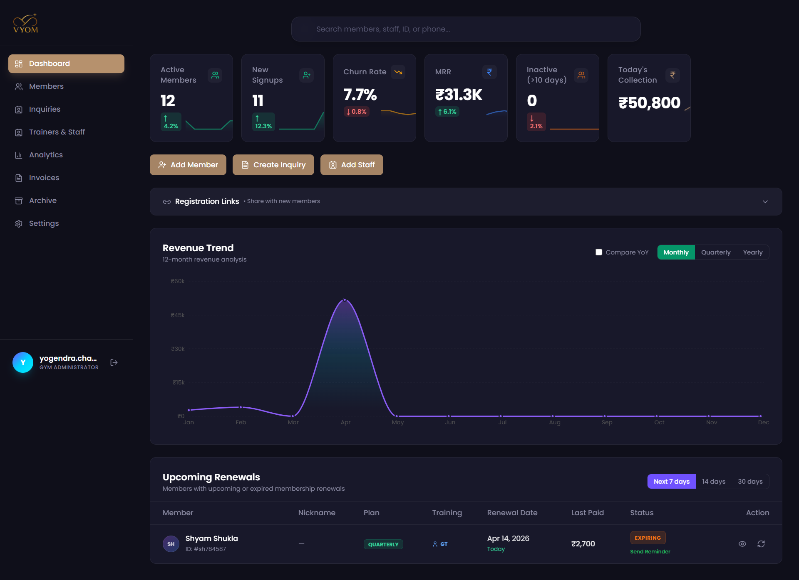
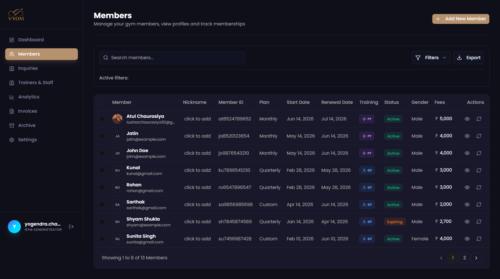
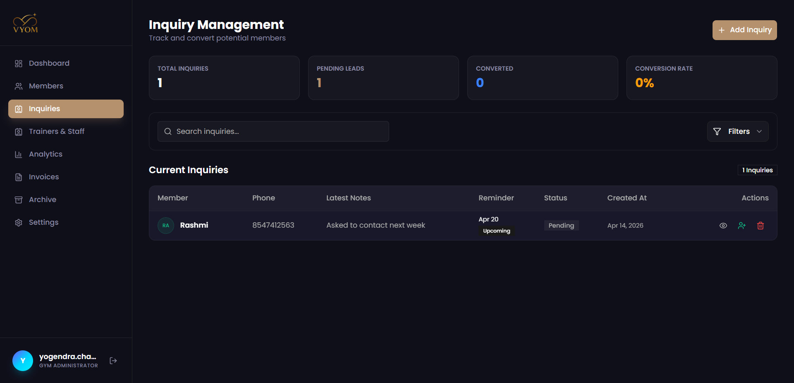
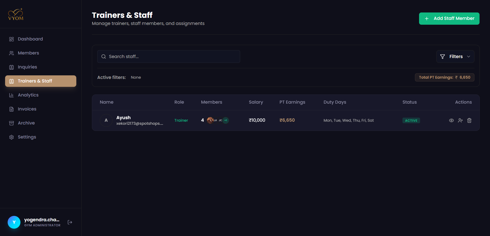
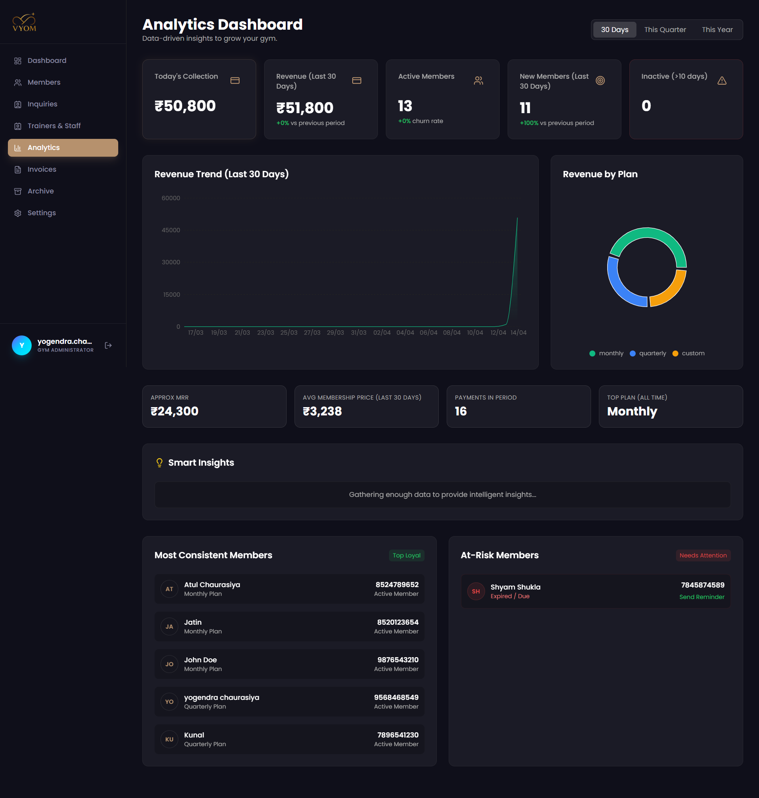
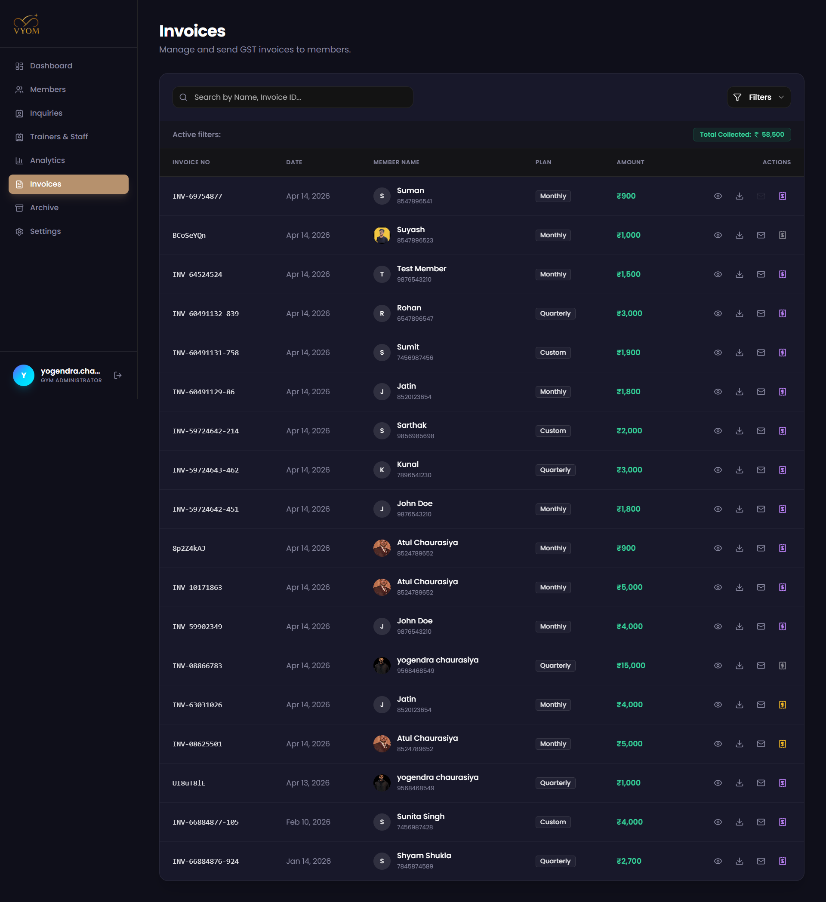
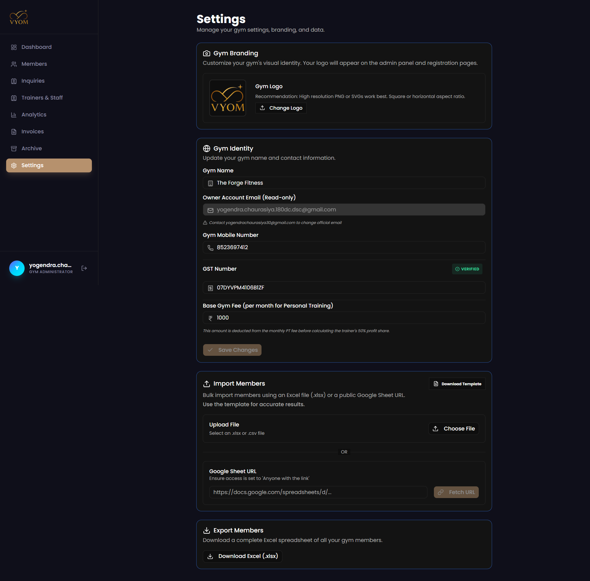

# 🏋️ GYMMANAGR - The Monolithic Structure for Business Evolution

<div align="center">
  

  <br />
  <br />

  [](https://gymmanagr.vercel.app)
  []()
  []()
  []()
  []()
  []()

  []()
  []()
  []()
  []()
  
  <p align="center">
    <b>Transform your gym into an elite performance center with automated management and intelligent growth tools.</b>
  </p>
</div>

---

## 🌟 What is GYMMANAGR?

**GYMMANAGR** is a full-stack, enterprise-grade gym management platform designed to eliminate the friction of daily operations. From automated member billing and trainer earning calculations to intelligent WhatsApp reminders and a secure gym onboarding workflow, GymManagr provides the monolithic structure your business needs to scale.

It replaces fragmented spreadsheets and manual tracking with a unified, data-driven dashboard that empowers owners, trainers, and front-desk staff.

🔗 **Live Website:** [https://gymmanagr.vercel.app](https://gymmanagr.vercel.app)

---

## 📸 Platform Experience

<table align="center">
  <tr>
    <td></td>
    <td></td>
    <td></td>
    <td></td>
  </tr>
  <tr>
    <td></td>
    <td></td>
    <td></td>
    <td></td>
  </tr>
</table>

---

## ✨ Key Features

### 🔥 For the Gym Owner
* **Dynamic Branding:** Automatically applies your gym's logo and primary colors to the dashboard, invoices, and public registration pages.
* **Trainer Revenue Tracking:** Automated PT (Personal Training) earning calculations with customizable gym-percentage deductions.
* **Advanced Analytics:** Real-time revenue trends, MRR tracking, churn rate analysis, and member behavior insights.
* **Onboarding Workflow:** A structured path for new gyms to register, upload branding, and get verified before going live.

### 💼 For the Staff (Trainers & Front Desk)
* **Unified Inquiry Management:** Track potential members from lead to conversion with follow-up reminders.
* **Member Database:** Searchable, filterable database with detailed profiles, medical history, and payment status.
* **Attendance & Status:** Monitor active, expiring, and inactive members at a glance.

### 🤖 Intelligent Automation
* **WhatsApp Integration:** Send personalized invoices and membership renewal reminders directly to members.
* **Automated Invoicing:** Generate professional PDF invoices upon payment with dynamic gym branding.
* **Smart Insights:** AI-driven suggestions for improving member retention and revenue growth.

---

## 🛠️ Tech Stack Architecture

### 💻 Frontend (Client-Side)
- **Framework:** Next.js 14 (App Router)
- **Language:** TypeScript
- **Styling:** Tailwind CSS + Shadcn/UI (Aesthetic: Industrial Dark / Glassmorphism)
- **Animations:** Framer Motion
- **Charts:** Recharts

### 🗄️ Backend & Infrastructure
- **Logic:** Next.js Server Actions
- **Database:** Firebase Firestore (Real-time NoSQL)
- **Auth:** Firebase Authentication (Email/Password & Social)
- **Assets:** Cloudinary (Logo & Profile Image Storage)
- **Messaging:** Meta WhatsApp Cloud API
- **Emails:** Gmail SMTP / Nodemailer

---

## 🚀 Getting Started (Local Development)

### 1️⃣ Clone and Install
```bash
git clone https://github.com/yogi03/gymmanagr.git
cd gymmanagr
npm install
```

### 2️⃣ Environment Configuration
Create a `.env` file in the root directory:
```env
# Firebase Configuration
NEXT_PUBLIC_FIREBASE_API_KEY="..."
NEXT_PUBLIC_FIREBASE_AUTH_DOMAIN="..."
NEXT_PUBLIC_FIREBASE_PROJECT_ID="..."
NEXT_PUBLIC_FIREBASE_STORAGE_BUCKET="..."
NEXT_PUBLIC_FIREBASE_MESSAGING_SENDER_ID="..."
NEXT_PUBLIC_FIREBASE_APP_ID="..."

# Firebase Admin SDK
FIREBASE_SERVICE_ACCOUNT_KEY="..."

# Integration Keys
CLOUDINARY_URL="..."
WHATSAPP_TOKEN="..."
WHATSAPP_PHONE_NUMBER_ID="..."

# System Config
SYSTEM_ADMIN_EMAIL="unfav.tushar@gmail.com"
ADMIN_APPROVAL_TOKEN="..."
```

### 3️⃣ Run Development Server
```bash
npm run dev
```
Open [http://localhost:3000](http://localhost:3000) with your browser to see the result.

---

## 🛡️ Security & Roles
GymManagr implements strict **Role-Based Access Control (RBAC)**:
- **Developer:** Platform-wide oversight and gym approvals.
- **Admin:** Full control over their own gym settings, members, and staff.
- **Trainer:** Access to assigned member lists and earning reports.
- **Front-Desk:** Daily operations, attendance, and inquiry management.

---

<div align="center">
  <i>Designed for elite performance. Optimized for business growth.</i>
  <p>© 2024 GymManagr. All rights reserved.</p>
</div>
